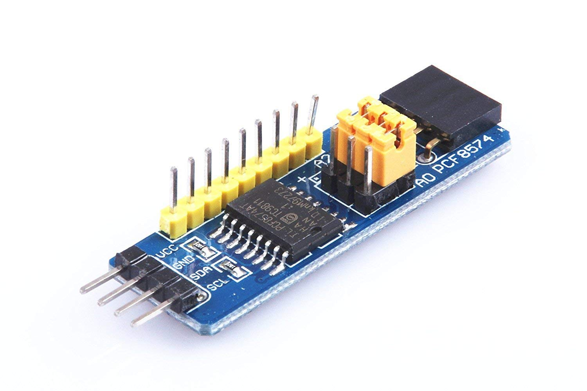

# [easiPCF8574 Arduino Library](https://github.com/ilneill/easiPCF8574)

This is a very simple Arduino Library to control the PCF8574 and PCF8574A 8-Bit I/O Expanders. 

The PCF8574 is a small IC that provides 8 general purpose I/O lines that are accessed and controlled via the I2C-bus. With its flexible addressing you can access up 128 I/O lines (8x PCF8574's + 8x PCF8574A's) all on the same 2-wire (and Power & Gnd, of course) I2C bus!

## Contents

1. [Library Features](https://github.com/ilneill/easiPCF8574/#library-features)
2. [Library Installation](https://github.com/ilneill/easiPCF8574/#library-installation)
3. [API Details](https://github.com/ilneill/easiPCF8574/#api-details)
4. [PCF8574 Chip Pinouts](https://github.com/ilneill/easiPCF8574/#pcf8574-chip-pinouts)
5. [A Common PCF8574 Module](https://github.com/ilneill/easiPCF8574/#a_common-pcf8574-module)
6. [Hardware Interrupt setup](https://github.com/ilneill/easiPCF8574/#hardware-interrupt-setup) 
7. [References](https://github.com/ilneill/easiPCF8574/#references)

## Library Features

This library uses the I2C communication protocol and implements reading and writing bits or bytes from/to PCF8574 and PCF8574A devices.

* I2C address support for the PCF8574 (0x20 - 0x27) and the PCF8574A (0x38 - 0x3f).
* GPIO group (8-bits) and individual pin control - set, clear and toggle.
* Arduino Hardware Interrupt feature setup using the PCF8574 INT pin.

## Library Installation

Currently the best (only) way you can install this library into your Arduino environment is manually from this repository.  

### Installing via this Repository 

First, you have to [download](https://github.com/ilneill/easiPCF8574/archive/refs/heads/main.zip) this library in zip format. 

Then, unzip the easiPCF8574-main.zip file into your Arduino Library folder. 

* On __Windows__: Documents\Arduino\libraries
* On __MAC OS__: ˜/Documents/Arduino/libraries
* On __Linux__: ˜/Documents/Arduino/libraries

## API Details

Class definition:
* PCF8574(uint8_t i2cAddress = 0x20);

- Create a PCF8574 instance.

Functions:
* bool    begin(uint8_t ioMask = 0xff);

- Set the I/O pins as input (1, high) or output (0/1, low/high). Returns TRUE if successful.
* bool    begin(uint8_t ioMask = 0xff, uint8_t interruptPin, void (*interruptFunction)()));

- Set the I/O pins as input, and attach an ISR for HIGH -> LOW transition on an Arduino pin. Returns TRUE if successful.
* void    attachInt(uint8_t interruptPin, void (*interruptFunction)()));

- Manually attach an ISR for HIGH -> LOW transitions on an Arduino hardware interrupt pin. Returns nothing.
* void    detachInt();

- Manually detach the ISR from the Arduino pin. Returns nothing.
* uint8_t read();

- Read all the PCF8574 pin values in a single byte. Returns the value read from the PCF8574.
* uint8_t write(uint8_t value);

- Write all the PCF8574 pin values in a single byte. Returns 0 = success, 1 = transmission error, 2 = address error.
* bool    digitalRead(uint8_t pin);

- Read the value of a single PCF8574 pin. Returns the value read from the PCF8574 pin, 0 = LOW (FALSE), 1 = HIGH (TRUE).
* uint8_t digitalWrite(uint8_t pin, bool value);

- Write a value to a single PCF8574 pin. Returns 0 = success, 1 = transmission error, 2 = address error.
* uint8_t digitalToggle(uint8_t pin);

- Change the value of a single PCF8574 pin, LOW->HIGH, HIGH->LOW -> 0. Returns 0 = success, 1 = transmission error, 2 = address error.

## PCF8574 Chip Pinouts

| DIP16 |  SO16 | SSOP20 | 
| ----- | ----- | ------ | 
| .png)| .png) | .png) | 

### Pin Descriptions of the PCF8574 DIP16, SO16 and SSOP20 Packages

|Pin Label | Pin Number (DIP16/SO16) | Pin Number (SSOP20) | Description |
|----------|-------------------------|---------------------|-------------|
|A0| 1| 6| (*1) I2C address setup |
|A1| 2| 7| (*1) I2C address setup |
|A2| 3| 9| (*1) I2C address setup |
|P0| 4| 10| (*2) Bidirectional I/O |
|P1| 5| 11| (*2) Bidirectional I/O |
|P2| 6| 12| (*2) Bidirectional I/O |
|P3| 7| 14| (*2) Bidirectional I/O |
|VSS| 8 | 15| GND - ground |
|P4| 9| 16| (*2) Bidirectional I/O |
|P5| 10| 17| (*2) Bidirectional I/O |
|P6| 11| 19| (*2) Bidirectional I/O |
|P7| 12| 20| (*2) Bidirectional I/O |
|INT| 13| 1| Interrupt output (active LOW) |
|SCL| 14| 2| I2C serial clock |
|SDA| 15| 4| I2C serial data |
|VDD| 16| 5| VCC - supply voltage |
|NC | |3,8,13,18| Not Connected |

* (*1) - You have 3 pins, A0, A1 and A2, to configure the I2C bus address.

       - All pins connected to GND will give you 0x20 + 0 = 0x20 (PCF8574) or 0x38 + 0 = 0x38 (PCF8574A).
       - All pins connected to VCC will give you 0x20 + 7 = 0x27 (PCF8574) or 0x38 + 7 = 0x3f (PCF8574A).
       - You can choose any address in these ranges by connecting A0, A1 and A2 to GND or VCC as appropriate.
* (*2) - The PCF8574 family devices consist of eight quasi-bidirectional ports.

       - See the [datasheet](https://www.nxp.com/docs/en/data-sheet/PCF8574_PCF8574A.pdf) for more details.

## A Common PCF8574 Module

The image below shows a common PCF8574 module that can be easily daisy-chained if required.

## Hardware Interrupt Setup

Every time a PCF8574 I/O pin changes its status, the PCF8574 clears the INT pin to a LOW logic level (0). 
You can use the interrupt feature, as an alternative to polling, to control how the Arduino deals with PCF8574 input events.

## References 

Other PCF8574 Arduino libraries that I was inspired by:
* https://github.com/pu2clr/PCF8574   <-This is the library I used at first!
* https://github.com/MSZ98/pcf8574
* https://github.com/linus81/PCF8574_LH
* https://github.com/RobTillaart/PCF8574
* https://github.com/xreef/PCF8574_library

The PCF8574/PCF8574A Datasheet:
* [NXP Semiconductors datasheet - PCF8574; PCF8574A - Remote 8-bit I/O expander for I2C-bus with interrupt](https://www.nxp.com/docs/en/data-sheet/PCF8574_PCF8574A.pdf)

A useful Internet tutorial:
* [Expand Arduino’s IO - Interfacing PCF8574 with Arduino](https://www.electronicshub.org/interfacing-pcf8574-with-arduino/)
  
  
// EOF